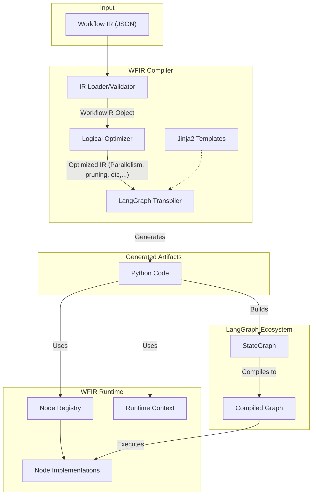

# WFIR
Workflow Intermediate Representation

This is a demo project to test LLM capability boundaries on programming. All coding are done by LLM, supervised by human.

# Notice
Google denied my request to switch region, so I couldn't access antigravity. So I used cursor + gemini 3 pro as an alternative.

